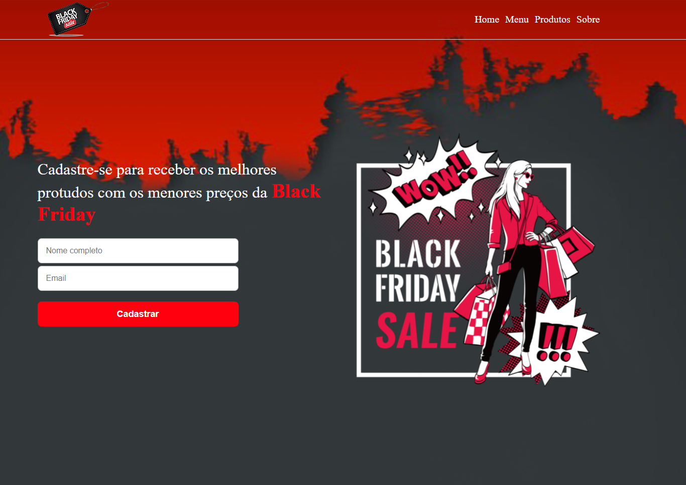

<h1 align="center">
  
</h1>

  <a href="#-tecnologias">Tecnologias</a>&nbsp;&nbsp;&nbsp;|&nbsp;&nbsp;&nbsp;
  <a href="#-projeto">Projeto</a>&nbsp;&nbsp;&nbsp;|&nbsp;&nbsp;&nbsp;
  <a href="#-layout">Layout</a>&nbsp;&nbsp;&nbsp;|&nbsp;&nbsp;&nbsp;

 

 

  

 

  Projeto desenvolvido para o Desafio #1 do programa de capacitação da Hiring Coders juntamente com a Gama Academy.

 

## 🚀 Tecnologias

Esse projeto foi desenvolvido com as seguintes tecnologias:

- HTML
- CSS
- JavaScript

## 💻 Projeto

### Desafio #1: Ecommerce

-Desafio - Criar um sistema de e-commerce para cadastro de email na landing page para recebimento de novidades e promoções.
-Como colocar uma loja online? Site Oficial / Landing page

1° Entrega 

- Site Oficial / Landing page  

Entregáveis: 

-Template do site oficial 

-Landing page de promoções, estilo black friday; 

-Cadastre seu e-mail para receber promoções 

-Dados no localstorage

- >Não é preciso ter domínio próprio e recomendamos o Netlify para hospedagem.

Bora lá? Então valendo! Esse desafio é individual, mas incentivamos que vocês troquem links entre si para feedbacks dos colegas <3

